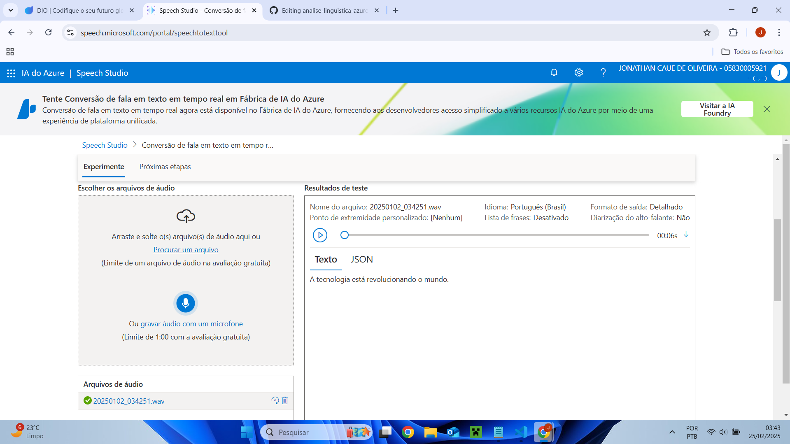
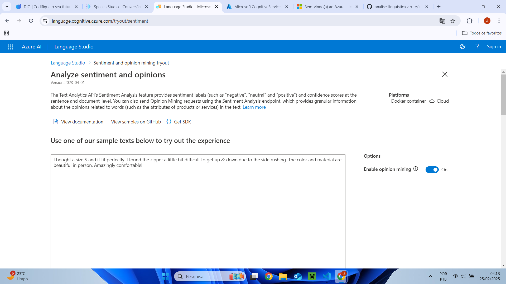
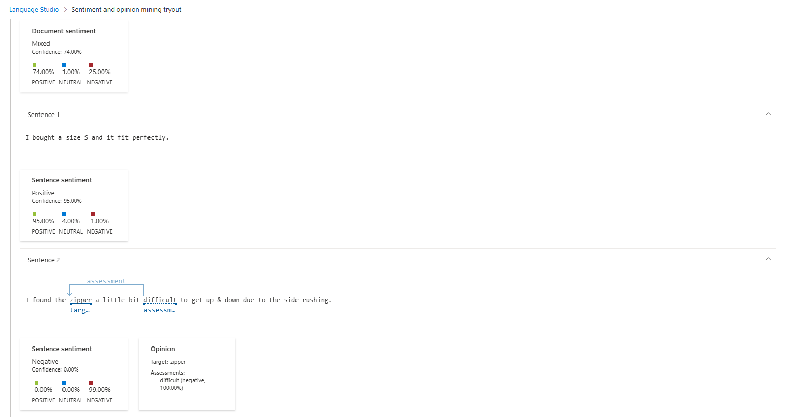
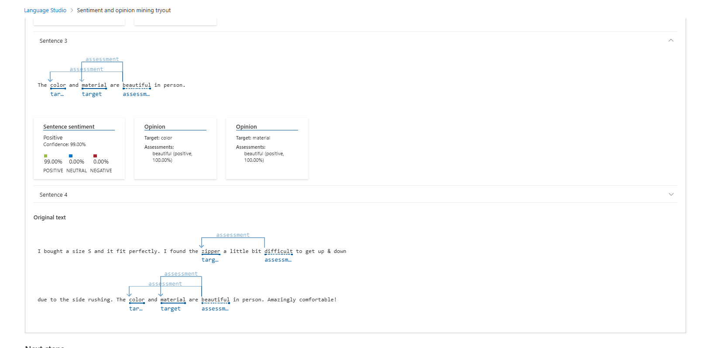

# 🚀 Análise Linguística com Azure AI - Decola Tech

Este projeto faz parte do programa **Decola Tech** e tem como objetivo explorar as funcionalidades do **Azure Speech Studio** e **Language Studio** para análise de fala e linguagem natural.

## 📂 Visão Geral do Projeto

Utilizamos as ferramentas da Microsoft Azure para:

- **Converter fala em texto** com o **Speech Studio**.
- **Analisar sentimentos e classificar textos** usando o **Language Studio**.

## 🔍 1. Speech-to-Text com Azure Speech Studio

No **Azure Speech Studio**, testamos a funcionalidade de **conversão de fala para texto**.

**Exemplo de transcrição:**

> "A tecnologia está revolucionando o mundo."

✅ **Texto gerado com sucesso a partir da fala!**

### **Print da Transcrição (Speech-to-Text):**


---

### **Prints da Análise de Sentimentos no Language Studio:**




---

## 🔍 2. Análise de Sentimentos com Language Studio

Submetemos as seguintes frases para análise no **Azure Language Studio**:

### **Frases analisadas:**

```
I bought a size S and it fit perfectly. I found the zipper a little bit difficult to get up & down due to the side rushing. The color and material are beautiful in person. Amazingly comfortable!
```

### **Resultados:**

| Frase                                                                 | Sentimento | Score  |
|-----------------------------------------------------------------------|------------|--------|
| I bought a size S and it fit perfectly.                               | Positivo   | 95%    |
| I found the zipper a little bit difficult to get up & down due to... | Negativo   | 99%    |
| The color and material are beautiful in person.                      | Positivo   | 99%    |

✅ **O modelo do Azure identificou corretamente o tom das frases!**

---

## 📚 3. Como Reproduzir o Projeto?

1. **Speech-to-Text**:

   - Acesse [Azure Speech Studio](https://speech.microsoft.com/).
   - Selecione **Speech-to-Text**.
   - Grave uma fala e veja a transcrição gerada.

2. **Análise de Sentimentos**:

   - Acesse [Azure Language Studio](https://language.cognitive.azure.com/).
   - Escolha **Sentiment Analysis**.
   - Insira frases e analise os resultados.

---

## 🌟 4. Aprendizados e Insights

- O **Speech-to-Text** funciona bem, mas pode errar em palavras complexas.
- A **Análise de Sentimentos** identificou corretamente tons positivos e negativos.
- Podemos usar essa tecnologia para **chatbots, assistentes virtuais e análise de feedbacks**.

---

## 📄 5. Conclusão

Este projeto mostrou como podemos usar **AI e NLP (Processamento de Linguagem Natural)** para transformar fala em texto e analisar sentimentos automaticamente. A implementação no Azure AI é simples e eficiente!

---


